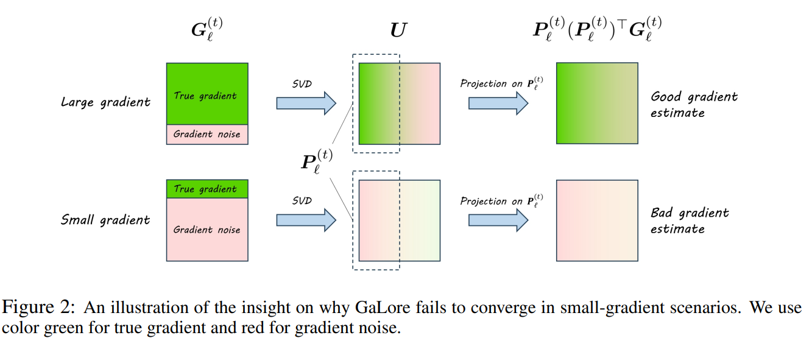
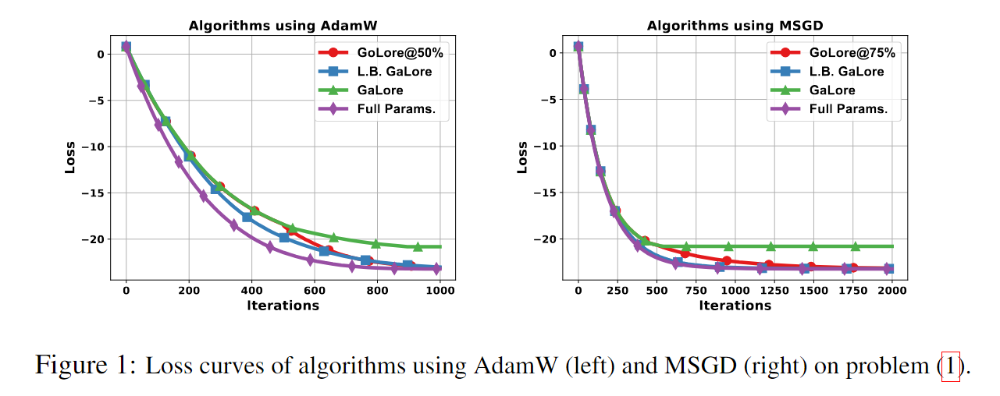
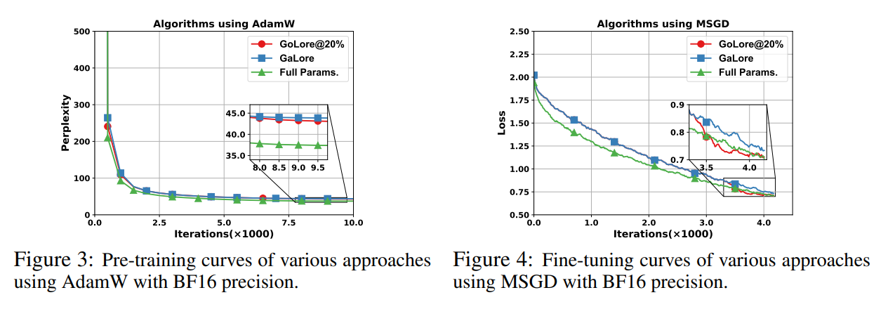

# Golore

This is the implementation for paper [Subspace Optimization for Large Language Models with Convergence Guarantees](http://arxiv.org/abs/2410.11289).

<!-- In this paper, we unexpectedly discover that GaLore does not always converge to the optimal solution, and we substantiate this finding with an explicit counterexample. Contrary to expectations, our investigation reveals that GaLore does **not** converge to stationary solutions under standard assumptions. Furthermore, our results show that regardless of whether AdamW or MSGD is employed as the subspace optimizer, GaLore fails to converge to the desired solution. In contrast, both GoLore and large-batch GaLore, along with full-parameter training, achieve exact convergence, thereby validating our theoretical results.  -->
In this paper, we proved that GaLore does not converge under standard assumptions because the SVD-based projection will lead to noise-dominated subspaces when the true gradient is relatively small. 



<!-- And then, we introduce GoLore (Gradient random Low-rank projection), a novel variant of GaLore that provably converges in stochastic settings, even with standard batch sizes. -->
Besides, we prove that GaLore can converge with deterministic or large-batch stochastic gradients, where the gradients used for computing the projection matrix are not noise-dominated. To guarantee convergence with small-batch stochastic gradients, we propose GoLore that uses random projection matrix sampled from a uniform distribution on the Stiefel manifold.


Experiments on both pre-training and fine-tuning LLMs have shown that using GoLore in the late training stages can achieve better performance than GaLore.



## Setup

### Install experiment dependencies

```
pip install -r requirements.txt
```
Our experiment scripts are tested on python 3.10 with PyTorch 2.3.

## Usage

Wrap the model with the **ReLoRA-like** structure.
```python
from peft_pretraining.GoLore import ReLoRaModel, ReLoRaLinear
model = ReLoRaModel(
            model,
            r=args.rank,
            lora_dropout=0,
            target_modules=["attn", "attention", "mlp"],
            scale = args.scale,
            keep_original_weights=True,
            lora_only=not need_linear_weight,
            quantize=args.quantize,
            use_double_quant=args.use_double_quant,
        )
```
Set `forward_type` in the training loop.
```python
if isinstance(model, ReLoRaModel):
    reset_relora = (step % args.gradient_accumulation_steps == 0 or step == len(train_dataloader) - 1) and completed_steps % args.update_proj_gap == 0
    model._config.forward_type = reset_relora
```
If `forward_type` is True, we use $Y=WX$ to collect the full gradient for the SVD decomposition.

If `forward_type` is False, we use $Y=(W+AB)X$ to forward the data regularly.

When we need a new projector every T steps, we execute the `merge_and_reinit` function to get the new projector.

```python
if isinstance(model, ReLoRaModel):
    if reset_relora:
        use_rand = (completed_steps / args.max_train_steps) >= args.rand_ratio
        logger.info(f"Performing lora reset at step {completed_steps}, use {'rand' if use_rand else 'svd'}")
        n_lora_restarts += 1
        model.merge_and_reinit(optimizer.optimizer, use_rand)
```

## Benchmark 1: Pre-Training LLaMA on C4 dataset

First, preprocess the dataset.
```sh
python pretokenize.py \
    --save_dir ./preprocessed_data \
    --tokenizer t5-base \
    --dataset c4 \
    --dataset_config en \
    --text_field text \
    --sequence_length 512
```
Second, you can use the following script to pretrain LLaMA model.

```sh
export DATA_PATH="./preprocessed_data/c4_en_t5-base_512"
torchrun --nproc-per-node 2 torchrun_main.py \
    --model_config configs/llama_60m.json \
    --dataset_path $DATA_PATH \
    --base_dir /data/datasets/c4_en \
    --autoresume True \
    --batch_size 128 \
    --total_batch_size 512 \
    --lr 0.001 \
    --max_length 256 \
    --rank 128 \
    --update_proj_gap 200 \
    --cycle_length 10000 \
    --warmup_steps 1000 \
    --num_training_steps 10000 \
    --save_every 10000 \
    --eval_every 500 \
    --save_dir /data/pretrained_models/Llama60M \
    --optimizer adamw \
    --rand_ratio 0.8 \
    --tags GoLore_60M_rand0.8 \
    --use_peft True \
    --Golore \
```
The `rand_ratio` is in the range [0, 1], denoting the ratio between the Galore (SVD) decomposition and the Golore decomposition. For example, when `rand_ratio` = 0.8, we use SVD for the first 80% of the iterations and Golore for the last 20%.

## Benchmark 2: Fine-Tuning RoBERTa on GLUE tasks

`run_glue.py` is the main script for this task, An example script is shown below:

```sh
python run_glue.py \
    --model_name_or_path roberta-base \
    --task_name mrpc \
    --lora_all_modules \
    --max_length 512 \
    --seed 42 \
    --lora_r 4 \
    --scale 4 \
    --per_device_train_batch_size 16 \
    --update_proj_gap 500 \
    --num_train_epochs 30 \
    --output_dir ./results/ft/roberta_base/mrpc \
    --learning_rate 3e-5 \
    --enable_golore \
    --rand_ratio 0.8 \
    # --with_tracking \
    # --report_to wandb \
```

## Benchmark 3: Fine-Tuning Llama-2-7b on WinoGrande dataset

This part is based on the [zo-bench](https://github.com/ZO-Bench/ZO-LLM?tab=readme-ov-file).

You can find more details in the folder `zo-bench`.

The main script is `./zo-bench/run.py` and An example script is shown below:

```sh
#!/bin/bash
export model_name="/data/pretrained_models/Llama-2-7b-hf"
lr=1e-3
momentum=0.9
dampening=0.0
optimizer=sgd
task_name=WinoGrande
num_train_epochs=30
time=$(date "+%Y%m%d%H%M%S")
python run.py --model_name=$model_name \
    --task_name=$task_name \
    --output_dir=result/$task_name-ft-$optimizer-$time \
    --num_train_epochs=$num_train_epochs \
    --per_device_train_batch_size=16 \
    --load_best_model_at_end \
    --evaluation_strategy=epoch \
    --save_strategy=epoch \
    --save_total_limit=1 \
    --eval_steps=500 \
    --max_steps=-1 \
    --logging_steps=10 \
    --num_eval=1000 \
    --num_train=1000 \
    --num_dev=100 \
    --train_all=True \
    --train_as_classification=False \
    --trainer=regular \
    --train_set_seed=0 \
    --lr_scheduler_type=constant \
    --save_steps=1000 \
    --load_bfloat16 \
    --bf16 \
    --optimizer=$optimizer \
    --learning_rate=$lr \
    --momentum=$momentum \
    --dampening=$dampening \
    --weight_decay=0.0 \
```

## Experiment: NON-CONVERGENCE OF GALORE

The main script is `./exp/main.py`. We can use Galore, AdamW, and Golore by setting `type` to 0, 1, and 2, respectively.

The parameter `T` and `grad_accumulation` determine the frequency with which we construct and the `batch_size` when we calculate the gradient at each "project time"(large batch).


## Citation

```bibtex
@article{he2024subspace,
  title={Subspace Optimization for Large Language Models with Convergence Guarantees},
  author={He, Yutong and Li, Pengrui and Hu, Yipeng and Chen, Chuyan and Yuan, Kun},
  journal={arXiv preprint arXiv:2410.11289},
  year={2024}
}
```